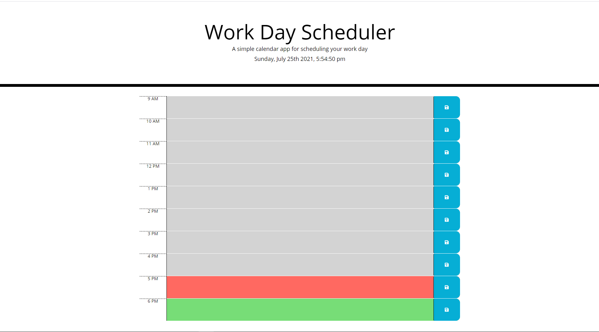

# Work Day Scheduler 
A daily planner to manage time effectively.

## Description
This app is for an employee with a busy schedule. With the current time and date at the top of the schedule, employees can keep track of appointments with the time blocks color code. They can tell which appointments have passed, which are present, and any future appointments.  When the employee clicks on a time block, they can enter any task or work and save them.  When they refresh the page, the tasks are still preserved.

### Built With
HTML
CSS
JavaScript

### Website
https://shannonposey.github.io/Work-Day-Scheduler/
## Author
👤 **Shannon Posey**

* GitHub: [@ShannonPosey](https://github.com/ShannonPosey)

* LinkedIn: [@https:\/\/www.linkedin.com\/in\/shannonposey](https://linkedin.com/in/https:\/\/www.linkedin.com\/in\/shannonposey)
## 🤝 Contributing

Made by Shannon Posey
## 📝 License

Copyright © 2021 [Shannon Posey](https://github.com/ShannonPosey). 

***
